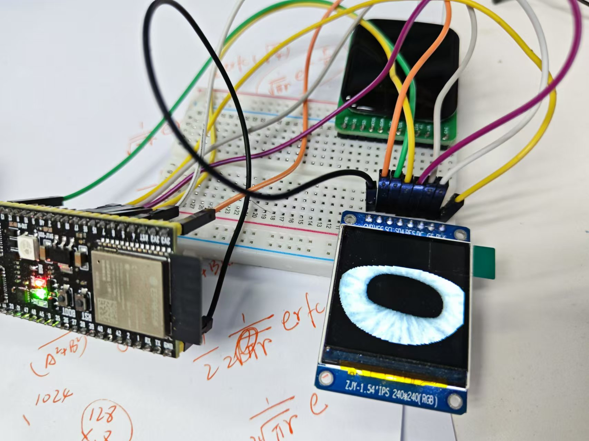
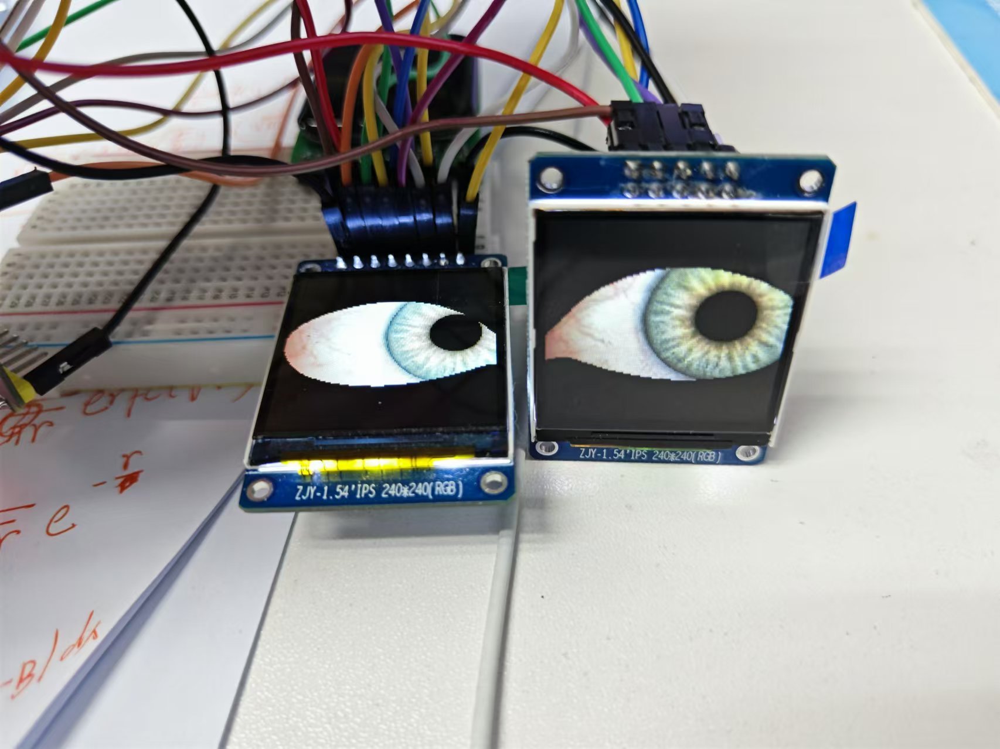

# DiyEyes | DIY眼珠
### 基于开源项目：[TFT_eSPI](https://github.com/Bodmer/TFT_eSPI)

### Auther：@kkl

---

## Introductions
一对可玩性很高的DIY眼珠（当然也可以是一只，可以任意控制眼球的转向，瞳孔的大小，上下眼睑的闭合与张开，同时可以拥有个性，自定义设计属于自己的眼珠...

## Snapshots

## Showcase

---
## 鸣谢
- https://learn.adafruit.com/animated-electronic-eyes/customizing
- https://github.com/Bodmer/TFT_eSPI